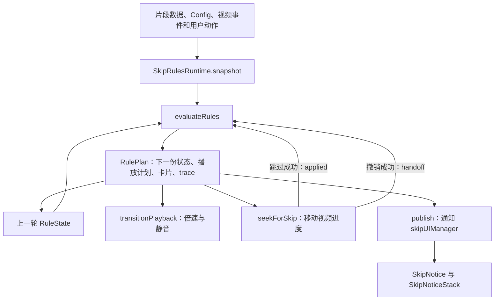

# 跳过规则引擎技术设计与开发

规则引擎把一次播放决定拆成纯计算和播放器操作。`evaluateRules()` 根据片段、播放器快照、本次经过状态及用户动作生成 `RulePlan`。`SkipRulesRuntime` 执行计划，卡片从计划派生。

这种划分让真实播放器和设置页示例共用判断逻辑。取消、回看和关闭属于片段状态，不依赖卡片 DOM 是否存在。

本文先说明当前运行机制，再给出开发与验证步骤。可按任务定位到以下部分。

- [数据流与输入](#从输入到执行反馈)。
- [判断顺序与状态](#一轮判断的顺序)。
- [播放器执行与恢复](#执行计划与播放器状态)。
- [卡片与快捷键](#卡片与快捷键)。
- [灰度开关与经典模式](#灰度开关与经典模式)。
- [开发与验证](#开发与验证)。

## 从输入到执行反馈

实现入口是 [engine.ts](../src/content/skipRules/engine.ts) 和 [runtime.ts](../src/content/skipRules/runtime.ts)。数据类型定义在 [types.ts](../src/content/skipRules/types.ts)。



`runtime.segments()` 先读取 `contentState.rawSegments`，再按 UUID 合入 `sponsorTimes` 和 `sponsorTimesSubmitting`。后两者覆盖同 ID 的服务器候选，所以本地修改和草稿能进入本轮判断。后台同时返回原始候选与过滤后的展示集合，见 [segmentRequest.ts](../src/requests/background/segmentRequest.ts)。

`snapshot()` 将分类配置转为 `Policy`，并读取视频时间、暂停、缓冲、白名单、编辑目标和用户偏好。片段终点最多取到当前视频时长。`policyPreferences()` 和 `rulePreferences()` 在 [preferences.ts](../src/content/skipRules/preferences.ts) 中完成配置映射。

`evaluateRules()` 不读取 `Config`、DOM、网络或系统时钟。函数复制上一份状态后计算，调用方负责保存返回的 `plan.state`。`plan.seek` 是待执行请求，不表示视频已经跳过。

## 分类、动作和本次经过各自表达不同的事

`RuleSegment.policy` 表达处理偏好，取值为 `auto`、`manual`、`mark` 或 `ignore`。`RuleSegment.action` 表达片段动作，取值为 `skip`、`mute`、`poi` 或 `full`。分类提供默认偏好，不能代替用户对本次播放的选择。

快进不是持久化的分类策略。当前实现用 `auto` 配合全局 `enableSpeedUp`，将符合条件的自动跳过替换为倍速播放。设置页模型中的 `Mode = 'fast'` 是这个组合的示例入口。

`RuleState.visits` 按片段 ID 保存本次经过。`Visit.auto` 记录本次经过是否允许自动判断，`Visit.automatic` 记录本轮资格判断的结果。获得自动资格后，执行仍受暂停和缓冲限制。

`Visit.excluded` 保存用户取消、撤销、关闭、暂停快进或接管倍速的原因。`Visit.manual` 保存明确请求的静音或快进。`Visit.phase` 表达处理阶段，卡片读取这个阶段，不反过来决定播放。

## 一轮判断的顺序

[engine.ts](../src/content/skipRules/engine.ts) 按以下顺序组合规则。

1. `prepareSegmentPolicies()` 根据分类配置和视频事实计算有效策略。
2. `updateVisits()` 判断每段的进入和离开，并接收执行成功反馈。
3. `applyUserIntent()` 应用明确的跳过、撤销、取消、关闭及改速动作。
4. `resolveOverlap()` 更新回看来源，并计算其他片段受到的限制。
5. `applyResumePreferences()` 处理真正暂停后的恢复偏好。
6. `eligibility()` 判断各段资格，`planSegmentPlayback()` 计算阶段及快进、静音需求。
7. 引擎处理精彩点导航，再用 `mergeSeek()` 合并获准的自动跳过区间。
8. `projectSegment()` 从最终片段状态生成卡片和计时信息。

顺序决定语义。例如，先合并跳过区间再处理取消，会把已经取消的成员留在目标终点中。先生成卡片再决定快进，则会让隐藏卡片影响播放。

### 策略覆盖与资格限制

[policy.ts](../src/content/skipRules/policy.ts) 顺序执行所有命中的策略规则。音乐视频自动处理先运行，同类别全片标记随后可将自动改为手动。最短时长、静音许可和来源限制再排除不适用的片段。有效策略只属于本轮输入，不写回分类配置。

视频中的 `music_offtopic` 片段提供音乐视频事实，`full` 片段提供对应类别的全片标记。完整视频标签不会作为普通区间参与合并跳过。

[rules.ts](../src/content/skipRules/rules.ts) 中的 `eligibilityRules` 使用第一条命中的限制。无效区间、主动关闭、全局停用、编辑范围、草稿资格及分类策略先决定片段是否可参与。取消、本次改手动和手动分类随后限制自动处理。回看保护能进一步阻止自动处理，而不改变该片段自己的取消状态。

两种规则不能互换：策略覆盖允许多条依次生效，资格限制选择一条原因。两者都把决定写入 `plan.trace`。

### 本次经过的边界

[visits.ts](../src/content/skipRules/visits.ts) 用左闭右开的区间 `[start, end)` 判断位置。

从片段外进入片段内会开始新一次经过。用户从前方拖入或从后方拖回，都受 `skipOnSeekToSegment` 控制。同段内拖动保留本次状态，暂停和刷新数据也不自动清除取消。

关闭预告会排除即将发生的那次经过。自然离开、拖离或跨过整段后，再次进入会重新判断。完成卡片的计时结束只关闭展示，不生成 `dismiss`。关闭按钮对对应片段发送 `dismiss`；关闭快捷键对所有非预告卡片发送 `dismiss`，取消各自的本次处理。全局隐藏提醒及页面清理只关闭展示。

`deny` 取消自动处理，但保留手动入口。`dismiss` 排除本次经过并去掉卡片。`undo` 建立回看意图。三者在 [intents.ts](../src/content/skipRules/intents.ts) 中分别处理。

### 撤销与重叠保护

普通跳过的 `undo` 请求返回所选片段的起点。静音片段默认只撤销静音，`forceSeek` 才要求返回起点。

[overlap.ts](../src/content/skipRules/overlap.ts) 将回看来源保存在 `RuleState.reviews`。每轮重新计算 `plan.protectedBy`，不把保护写成其他片段的 `excluded`。

例如 A 为 10–20 秒，B 为 15–30 秒，两段都自动快进。在 22 秒撤销 A，会回到 10 秒。回看 A 期间，B 暂停自动处理。播放到 20 秒后，A 的回看范围结束，B 的剩余部分按自身策略和本次状态处理。

保护只作用于直接重叠、动作类型相同的自动片段。相邻不算重叠，A 保护 B 也不会让 B 继续保护 C。明确跳过、允许处理或恢复快进可以覆盖目标片段受到的保护。新的撤销会重新建立保护。

### 暂停、恢复与编辑

`canAutomaticallyPlay()` 要求视频既未暂停，也未缓冲。暂停时拖动会更新状态和卡片，但不启动自动跳转或快进。明确点击跳过仍可移动进度，且不会因此播放视频。

[resume.ts](../src/content/skipRules/resume.ts) 用 `Visit.resumeFrom` 区分暂停时尚未处理的进入和已开始的快进。`skipResumeAction` 与 `speedUpResumeAction` 分别决定恢复后继续处理还是本次改为手动。单纯缓冲不触发这两个暂停恢复偏好。

`SubmissionNoticeComponent` 通过 `setEditing()` 通知 runtime。默认编辑范围只包含明确选择的预览目标，`previewIncludeOtherSegments` 可允许其他片段参与。草稿只有被选为 `previewId` 才能处理。预览按钮和预览快捷键均通过 `skip/previewTime` 传入草稿 UUID；快捷键选择最新草稿。这个公共入口也记录 `previewedSegment`，供提交前的预览检查使用。关闭隔离编辑时，`edit-end` 将当前位置内的经过保留为手动，避免关窗立即跳走。

## 执行计划与播放器状态

`RulePlan.seek` 包含目标时间、成员 ID 和 `skip` 或 `undo` 原因。`speed` 和 `mute` 分别列出当前需要快进、静音的成员。

[planner.ts](../src/content/skipRules/planner.ts) 只合并相邻或重叠的获准自动区间，不跨过正常内容的空隙。合并只产生一个跳转目标，各段仍保留自己的经过和卡片。明确点击普通片段的跳过按钮只请求该段终点，不进入自动合并流程。

[playback.ts](../src/content/skipRules/playback.ts) 的 `playbackMethod()` 将静音片段交给静音处理。普通自动跳过只有在快进开启、区间至少 0.5 秒且不是草稿时才使用倍速，其余情况直接跳转。

`transitionPlayback()` 是真实播放器与模拟器共用的纯状态转换。它接收当前倍速、静音及插件保存的原值，计算下一份播放器状态。runtime 在写入视频属性前保存这些记录，避免把自己的 `ratechange` 识别为用户改速。

`RulePlan.retain` 明确给出暂停和缓冲期间仍允许保留的效果，不用于启动新效果。`planSegmentPlayback()` 只根据本轮输入中的有效片段及当前处理方式设置它；播放器和模拟器不再扫描历史经过状态来决定是否保留效果。关闭快进、删除片段或缩短区间后，最新计划会释放不再有效的效果。其他重叠片段仍需要的效果继续保留。缺失片段清除执行阶段，但仍在旧区间内时保留用户本次取消意图，避免数据重新出现后再次自动处理。

恢复倍速前会核对当前值是否仍等于插件设置的目标值。用户主动改速后，runtime 放弃恢复旧倍速，并对相关片段发送 `user-rate`。用户主动解除插件静音时，runtime 取消相关片段本次静音。原本已静音的视频在处理结束后仍保持静音。

`speedUpTarget()` 保留既有倍速计算。配置范围限制在 1.1 到 16 倍。配置倍速与原速的差不超过 0.05 时使用两者之和，否则取较大值，最终不超过 16 倍。

### 跳转成功反馈

runtime 调用 `seekForSkip()` 前记录 `ownedSeek`，避免把对应的 `seeking` 当成用户拖动。调用后，视频时间与目标相差小于 0.25 秒才进入成功路径。

跳过成功会发送 `applied`，将成员标为完成，再评估落点处的片段。撤销成功发送 `handoff`，保留回看意图。跳转失败不会发送完成反馈，也不会记录成功跳过。

runtime 通过 `recordSkippedSegments()` 复用统计入口，通过 `notifyAutomaticSkip()` 复用提示音。明确手动跳过不触发自动跳过提示音。快进统计根据真实播放进度累计，不根据卡片存活时间累计。

### 调度与清理

`registerSkipRules()` 订阅片段、配置、白名单及视频生命周期事件。runtime 直接监听当前 video 的 `timeupdate`、`seeking`、`seeked`、`pause`、`waiting`、`playing`、`ratechange` 和 `volumechange`。

runtime 每次评估先取消上一轮调度。播放中按下一个片段边界与当前倍速计算延迟，限制为 8 到 100 毫秒。暂停或缓冲时使用 100 毫秒。另有一个 250 毫秒的检查用于发现模式或视频元素变化，不承担片段边界判断。

身份由视频 ID 和 CID 组成。身份变化会清空经过、卡片发布缓存和隐藏快捷键目标。同一身份仅更换 video 元素时，runtime 保留经过状态，重新绑定监听器。`reset()` 取消调度并恢复仍由插件控制的播放器属性。

执行异常会设置 `failed`、释放播放器效果并停止当前 runtime 的规则执行。异常不会立即切换到旧调度器，避免发生第二次自动处理。

## 卡片与快捷键

[cards.ts](../src/content/skipRules/cards.ts) 只派生 `RuleCard`。`preview` 使用片段起点作为媒体时钟边界，进行中阶段使用终点，`completed` 使用显示时钟。

[NoticeClock.ts](../src/notices/NoticeClock.ts) 分开处理两种时间。媒体倒计时读取视频当前位置和倍速，视频暂停时不会自行减少。完成提示按实际经过的时间退出，悬停会暂停计时而不重置剩余时间。

`publish()` 只在卡片投影变化时发送 `SKIP_NOTICE_REQUESTED`。[skipUIManager.ts](../src/content/skipUIManager.ts) 负责选择或更新 notice。[SkipNotice.tsx](../src/render/SkipNotice.tsx) 保留已有 notice 的 React 实例，[SkipNoticeStack.ts](../src/render/SkipNoticeStack.ts) 负责堆叠位置和动画。尚未销毁的同片段卡片可以从预告更新为完成，不需要再次入场。

`dontShowNotice` 只控制展示。隐藏时 runtime 仍缓存可操作目标，`toggleSkip()` 选择最近更新且仍有效的目标。完成状态的撤销按 `skipNoticeDuration` 到期，用户拖动会使旧完成目标失效。显示卡片时沿用焦点、悬停及现有 notice 目标选择。

卡片按钮与隐藏提示快捷键共用 `primaryAction()`。快捷键入口在 [hotkeyHandler.ts](../src/content/hotkeyHandler.ts)，输入控件和非插件绑定的按键继续交给页面。

## 灰度开关与经典模式

`skipEngineMode` 默认是 `legacy`。手动启用入口位于「实验功能」，新版行为页面顶部提供「使用经典模式」按钮。两处都修改同一个配置值，同时切换配置界面与执行引擎，其他配置在两种模式间共享。

`legacy` 由 `skipScheduler` 和 `speedUpManager` 执行。`rules` 由 `SkipRulesRuntime` 执行，旧模块的相关入口通过 `isRuleEngineEnabled()` 退出或转交。内部 `shadow` 模式让旧引擎执行，新引擎只计算和记录计划。打开设置页会把 `shadow` 归为 `legacy`，用户界面不提供 shadow 选项。

[bridge.ts](../src/content/skipRules/bridge.ts) 定义 `RuleRuntime` 接口和模式查询入口。shadow 读取的是旧引擎实际推进的时间线，其日志不能代替新引擎独立执行的测试。

[content.ts](../src/content.ts) 注入 `stopLegacy`、`startLegacy` 和统计回调。切换涉及 rules 模式时，会释放原模式的调度和播放效果，关闭旧卡片，再按当前位置运行所选引擎。已经打开的视频无需刷新。模式切换不迁移两种引擎各自的临时经过状态。

[skipRulesRollout.ts](../src/config/skipRulesRollout.ts) 在配置迁移时按用户 ID 的固定哈希分配 0–99 的桶，前 20 个桶自动启用。没有用户 ID 时推迟到下次配置加载，不使用随机数。`skipRulesRollout` 记录一次性结果：`auto` 为自动入选，`invite` 为未入选，`excluded` 为关闭新功能提示，`existing` 为已有明确引擎配置；初始值为 `pending`。迁移读取添加默认值前的键集合，已有 `skipEngineMode` 时保留用户选择。分组完成后，即使用户退出或更换 ID，也不会重新启用。

[rollout.ts](../src/options/rules/rollout.ts) 只负责设置页引导。自动入选者首次打开完整设置页时看到欢迎说明；未入选者看到可关闭的邀请气泡。`showNewFeaturePopups=false` 同时阻止自动入选和引导提示，仍允许在实验功能中主动启用。`skipRulesNotice` 区分未提示、已关闭邀请和已关闭欢迎说明，跨窗口与设备同步；关闭邀请后仍可手动启用并查看欢迎说明。嵌入式设置页不显示引导。经典执行链仍是可用的回退路径。

## 设置页面与持久化

[RulesPage.tsx](../src/options/rules/RulesPage.tsx) 组织片段设置、播放行为、卡片提醒、标签与评论、操作测试和规则说明。`settingsLayout.ts` 定义真实配置的归属，`SettingsPanel.tsx` 读写设置，`NativeOptions.tsx` 复用原有复杂控件。

[model.ts](../src/options/rules/model.ts) 准备示例输入，并复用 `evaluateRules()`、`transitionPlayback()` 和 `NoticeClock`。示例操作不控制真实视频，也不保存示例处理方式。在“修改真实设置”中编辑的内容则写入 `Config`。

模拟器不模拟真实播放器的 DOM、网络和媒体事件时序。示例结果正确不能代替加载扩展后的浏览器回归。

[categoryConfig.ts](../src/config/categoryConfig.ts) 将各分类的禁用保存为显式 `Disabled`。旧数据缺少 padding 且没有迁移标记时，只补一次自动跳过。已有明确值不变，已迁移后的缺失条目保持禁用。其他旧分类缺失时保留禁用语义。

[ProtoConfig](../src/config/config.ts) 保存待写入值，并过滤会覆盖较新本地修改的旧存储通知。`forceSyncUpdate()` 共用普通赋值的保存路径。倒计时输入保留编辑草稿，离开输入框时再校验并保存。

## 当前实现的边界

精彩时刻由服务端确保每个视频只返回一个。`engine.ts` 单独处理该目标，不参与普通区间合并；不为多个精彩点定义额外的选择顺序。

runtime 的播放器精彩点按钮发布缓存只比较目标 ID。只修改 `hideSkipButtonPlayerControls` 且目标不变时，runtime 不重新发布按钮状态。

规则解释来自 `RULES`、`ruleDefinitions` 和 `plan.trace`。用户可以修改现有配置，不能在页面上编写任意规则或为每个矩阵格子定义动作。弹幕来源只保留 runtime 中原有的配置映射，不属于设置页示例模型。

## 开发与验证

按改动类型选择下面的步骤。浏览器测试环境见[Playwright 页面集成测试](playwright-e2e.md)。

### 准备当前工作区

1. 按[贡献指南](../CONTRIBUTING.md)安装依赖并准备 `config.json`。
2. 运行 `npm run build:dev`。
3. 在 Chromium 扩展管理页加载当前工作区的 `dist/`。
4. 在扩展的**行为**页面打开**启用新版规则引擎（灰度体验）**。

修改代码后，重新构建当前工作区。重新加载扩展，再刷新已经打开的视频页。切换引擎设置本身即时生效，重新构建的扩展代码则需要重新加载。

### 定位一条错误的决定

1. 记录视频 ID、CID、各段 UUID、时间范围、分类和动作。
2. 记录 `skipEngineMode`、快进设置、暂停状态和操作顺序。
3. 在视频页开发者工具中选择扩展内容脚本的执行上下文。
4. 读取规则日志。

```js
window.SBLogs.debug.filter(line => line.includes('[SB Rules]'))
```

5. 对照日志中的 `decisions`、`seek`、`speed` 和 `mute`。
6. 在 [rules.ts](../src/content/skipRules/rules.ts) 中查找命中的规则编号。

如果需要持续查看控制台日志，在设置中开启 `lifecycleDebug`。`logDebug()` 的本地缓冲即使未开启控制台输出也会保存日志。

如果计划正确而播放器结果错误，在 `SkipRulesRuntime.run()` 和 `applyPlayback()` 设置断点。核对 `input`、`plan`、`ownedSeek`、实际视频时间及倍速。不要用卡片是否出现判断执行是否成功。

如果计划已经错误，把操作序列转为纯函数测试。沿用 [skipRules.test.ts](../test/skipRules.test.ts) 的 `segment()`、`defaults` 和 `sequence()`。例如，下面的用例核对跳转请求与成功反馈的区别。

```ts
test('completion follows successful execution feedback', () => {
	const step = sequence();
	const requested = step(12);
	expect(requested.seek?.time).toBe(20);
	expect(requested.cards.A.phase).toBe('pending');

	const applied = step(20, { kind: 'applied', ids: ['A'] });
	expect(applied.cards.A.phase).toBe('completed');
});
```

### 修改片段的默认策略

1. 在 [policy.ts](../src/content/skipRules/policy.ts) 中修改 `policyRules`。
2. 在 [rules.ts](../src/content/skipRules/rules.ts) 中登记稳定的 `RULES` 编号及 `ruleDefinitions`。
3. 在 [segmentPolicies.test.ts](../test/segmentPolicies.test.ts) 中添加覆盖顺序测试。
4. 在 [skipRules.test.ts](../test/skipRules.test.ts) 中验证有效策略与本次取消、暂停及编辑状态的组合。

如果规则改变所有视频中某类片段的默认处理方式，将规则放在策略归一化阶段。如果规则只限制本次经过，在 `visits.ts`、`intents.ts` 或 `resume.ts` 中修改对应状态，避免写回分类配置。

保留策略覆盖的顺序。不要把依次生效的策略规则改成第一条命中就返回。

### 增加用户动作或跨片段限制

1. 在 [types.ts](../src/content/skipRules/types.ts) 的 `RuleEvent` 中声明动作及所需数据。
2. 在 [intents.ts](../src/content/skipRules/intents.ts) 的 `commands` 中实现单段状态转换。
3. 如果动作影响其他片段，在 [overlap.ts](../src/content/skipRules/overlap.ts) 中计算来源和目标的关系。
4. 从按钮或命令入口调用 `getRuleRuntime().action()`。
5. 为完整操作序列添加回归测试。

如果动作对应主按钮，同时修改 `primaryAction()`，让卡片与隐藏提示快捷键保持一致。

涉及回看保护时，修改 `reviews` 的来源或 `protectedBy` 的推导。不要把其他片段受保护的状态保存成它们自己的取消状态。用 [skipRuleOverlap.test.ts](../test/skipRuleOverlap.test.ts) 验证直接重叠、相邻、包含、多个来源及来源结束后的恢复。

### 增加处理方式

先确定新行为是分类策略、用户动作，还是播放器操作。当前分类没有逐类快进，`model.ts` 中的 `'fast'` 也不是可持久化策略。

如果新方式需要成为分类选项，按以下步骤修改。

1. 在 [types.ts](../src/types.ts) 的 `CategorySkipOption` 中定义持久化值。
2. 更新 [categoryConfig.ts](../src/config/categoryConfig.ts) 的迁移处理，保留用户明确禁用的记录。
3. 更新 [CategorySkipOptionsComponent.tsx](../src/components/options/CategorySkipOptionsComponent.tsx) 的读取与保存。
4. 更新 `RuleSegment`、`Policy` 及 `SkipRulesRuntime.snapshot()` 的配置映射。
5. 明确经典模式如何读取新值，并添加切回经典模式的测试。

如果新方式需要操作播放器，再完成以下步骤。

1. 在 `RulePlan` 和 `PlaybackState` 中声明执行所需的状态。
2. 在 [playback.ts](../src/content/skipRules/playback.ts) 中实现选择和恢复逻辑。
3. 在 `SkipRulesRuntime.applyPlayback()` 中添加实际播放器属性写入。
4. 在 [cards.ts](../src/content/skipRules/cards.ts) 中派生展示。
5. 在 [model.ts](../src/options/rules/model.ts) 中补齐示例输入与可操作项。

继续复用 `transitionPlayback()`。不要在模拟器中再实现一份暂停、倍速或静音恢复逻辑。只有需要真实视频或浏览器 API 的部分才进入 runtime。

### 增加可配置规则

1. 在 [config.ts](../src/config.ts) 中声明 `SBConfig` 字段和 `syncDefaults`。
2. 在 [preferences.ts](../src/content/skipRules/preferences.ts) 中将配置映射为引擎输入。
3. 在 `ruleDefinitions` 中列出规则相关的配置字段。
4. 在 [settingsLayout.ts](../src/options/rules/settingsLayout.ts) 中指定设置归属。
5. 在 [SettingsPanel.tsx](../src/options/rules/SettingsPanel.tsx) 中添加控件。
6. 在 [text.ts](../src/options/rules/text.ts) 和本地化文件中补齐说明。
7. 用 [rule-settings.spec.ts](../e2e/rule-settings.spec.ts) 验证保存、恢复默认和页面内相关设置入口。

如果复用原有复杂控件，在 [NativeOptions.tsx](../src/options/rules/NativeOptions.tsx) 中指定原节点及归属。不要复制第二份 DOM 或再绑定一套配置保存逻辑。快捷键继续放在原有的快捷键页面。

让 `public/_locales/en/messages.json` 与 `public/_locales/zh_CN/messages.json` 保持字节一致。用下面的命令核对。

```bash
cmp public/_locales/en/messages.json public/_locales/zh_CN/messages.json
```

为设置增加测试时，覆盖快速连续修改和重新加载。复用 [ProtoConfig](../src/config/config.ts) 的赋值入口。对原地修改的复杂值调用 `Config.forceSyncUpdate()`，不要直接绕过配置层写 `chrome.storage.sync`。

### 验证改动

先运行与修改职责对应的单元测试。现有测试文件分别覆盖这些范围。

- [skipRules.test.ts](../test/skipRules.test.ts)：进入、离开、明确操作和执行反馈。
- [segmentPolicies.test.ts](../test/segmentPolicies.test.ts)：策略覆盖与资格来源。
- [skipRuleOverlap.test.ts](../test/skipRuleOverlap.test.ts)、[skipRuleResume.test.ts](../test/skipRuleResume.test.ts)：回看关系与暂停恢复。
- [rulePlayback.test.ts](../test/rulePlayback.test.ts)、[skipRulesRuntime.test.ts](../test/skipRulesRuntime.test.ts)：播放器状态恢复、实际事件和隐藏快捷键。
- [ruleExplorer.test.ts](../test/ruleExplorer.test.ts)：矩阵和操作测试模型。
- [categoryConfig.test.ts](../test/categoryConfig.test.ts)、[configSync.test.ts](../test/configSync.test.ts)：分类迁移和配置保存时序。

运行单元测试与静态检查。

```bash
npx jest --runInBand
npx tsc --noEmit --skipLibCheck
npm run lint
```

`--skipLibCheck` 跳过依赖声明检查。仓库现有依赖在直接运行 `tsc --noEmit` 时有 React 默认导入和 Node Buffer 声明冲突。

构建扩展后，运行规则引擎与设置页回归。

```bash
npm run build:dev
npx playwright test e2e/skip-rules.spec.ts e2e/rule-settings.spec.ts
```

如果修改卡片、快捷键或经典模式共用入口，运行完整离线浏览器测试。

```bash
npx playwright test --grep-invert '@real|@local-server'
```

核对这些操作链，避免只验证一次点击。

- 段外进入、段内拖动、离开后再次进入。
- 暂停后多次拖动，再恢复播放。
- 相邻和重叠片段中撤销、关闭、改速及到达边界。
- 隐藏提示后跳过、撤销、到期及输入框内按键。
- 刷新片段范围、切换视频、替换 video 元素及切换引擎。

如果需要检查真实 Bilibili 播放器，运行相邻片段用例。该用例使用真实页面和固定片段快照，不向线上提交数据。

```bash
BSB_E2E_SKIP_ENGINE=rules npx playwright test e2e/notice-adjacent.real.spec.ts
```

从 `test-results/` 查看失败截图、录像和 trace。测试清单、代理设置和真实页面的环境限制见[Playwright 页面集成测试](playwright-e2e.md)。
